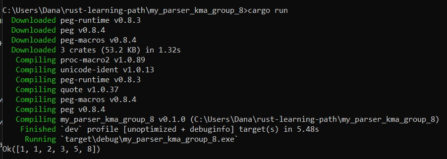

# My Parser

## Short Description
This parser analyzes and processes lists of numbers in string format. It uses the `peg` library for parsing input data, providing a simple interface for parsing numbers enclosed in square brackets.



## Example


```rust
peg::parser! {
    pub grammar list_parser() for str {
        rule number() -> u32
            = n:$(['0'..='9']+) {? n.parse().or(Err("u32")) }

        pub rule list() -> Vec<u32>
            = "[" l:(number() ** ",") "]" { l }
    }
}

pub fn main() {
    println!("{:?}", list_parser::list("[1,1,2,3,5,8]"));
}

